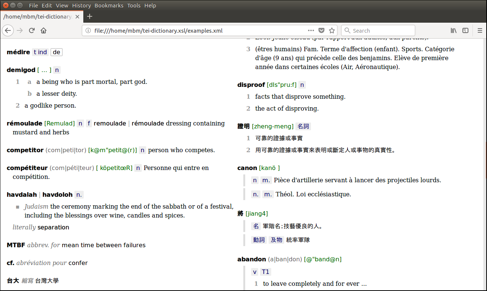

# tei-dictionary.xsl

This stylesheet takes entries encoded in XML according to the [TEI guidelines for dictionaries](http://www.tei-c.org/release/doc/tei-p5-doc/en/html/DI.html) and converts them into human-readable HTML. It fills a gap in TEI's own stylesheets which leave dictionary entries completely unformatted.

The goal is to make dictionary entries look good, to make them easily and pleasantly readable for humans, and to bring out their encoded structure as much as possible. These goals are sometimes mutually exclusive but I think the compromise I have come up with will work well for a broad range of sensibly (!) encoded dictionaries. The idea is that if it doesn't fit your data perfectly you can still use it as a basis and adapt it.
